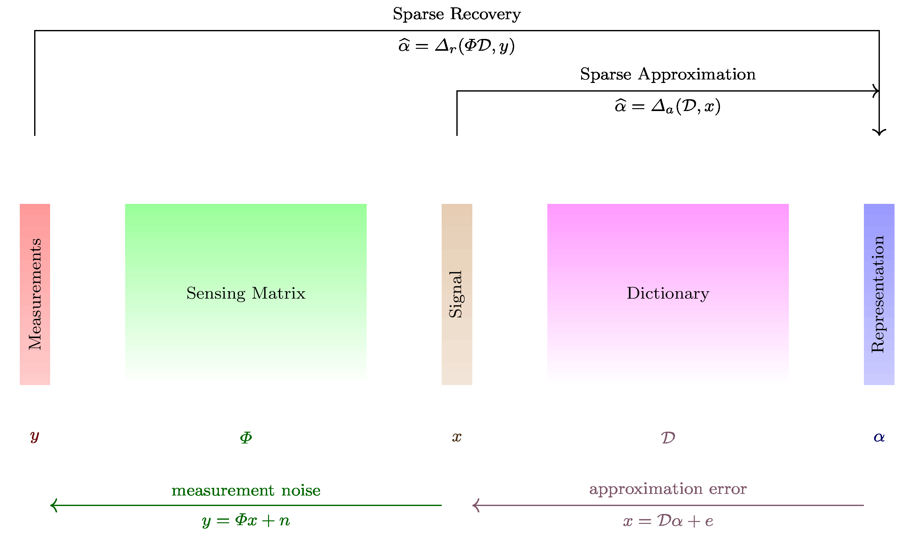

We introduce [`CR-Sparse`](https://github.com/carnotresearch/cr-sparse), 
a Python library that enables to efficiently solve a wide variety of sparse representation based signal processing problems.
It is a cohesive collection of sub-libraries working together. Individual
sub-libraries provide functionalities for:
wavelets, linear operators, greedy and convex optimization 
based sparse recovery algorithms, subspace clustering, 
standard signal processing transforms,
and linear algebra subroutines for solving sparse linear systems. 
It has been built using Google JAX, which enables the same high level
Python code to get efficiently compiled on CPU, GPU and TPU architectures
using XLA. 

Traditional signal processing exploits the underlying structure in signals
by representing them using Fourier or wavelet orthonormal bases. 
In these representations,
most of the signal energy is concentrated in few coefficients allowing greater
flexibility in analysis and processing of signals. More flexibility can be
achieved by using overcomplete dictionaries
(e.g. unions of orthonormal bases). However, the construction of
sparse representations of signals in these overcomplete dictionaries 
is no longer straightforward and requires use of specialized sparse
coding algorithms like orthogonal matching pursuit
or basis pursuit. The key idea behind these algorithms 
is the fact that under-determined systems $A x = b$ can be solved efficiently
to provide sparse solutions $x$ if the matrix $A$ satisfies specific conditions
on its properties like coherence. Compressive sensing takes the same 
idea in the other direction and contends that signals having sparse representations
in suitable bases can be acquired by very few data-independent 
random measurements $y = \Phi x$ if the sensing or measurement system $\Phi$
satisfies certain conditions like restricted isometry property.
The same sparse coding algorithms can be tailored for sparse signal recovery
from compressed measurements.

A short mathematical introduction to compressive sensing and sparse representation problems 
is provided in [docs](https://cr-sparse.readthedocs.io/en/latest/intro.html).

# Package Overview

The `cr.sparse.pursuit` package includes greedy and thresholding
based solvers for sparse recovery. It includes: 
`OMP`, `CoSaMP`, `HTP`, `IHT`, `SP` algorithms.
(provided in `cr.sparse.lop` package).
The `cr.sparse.cvx` package includes efficient solvers
for l1-minimization problems using convex optimization methods.
The `cr.sparse.sls` package provides JAX versions of
`LSQR`, `ISTA`, `FISTA`  algorithms for solving sparse linear 
systems.
These algorithms can work with unstructured random and dense sensing matrices
as well as structured sensing matrices represented as linear operators
The `cr.sparse.lop` package includes a collection of linear operators
influenced by [PyLops](https://pylops.readthedocs.io/en/stable/). 
`cr.sparse.wt` package includes a JAX version of major functionality
from [PyWavelets](https://pywavelets.readthedocs.io/en/latest) making it a first major pure 
Python wavelets implementation which can work across CPUs, GPUs and TPUs.

# Sparse signal processing problems and available solvers

We provide JAX based implementations for the following algorithms:

* `cr.sparse.pursuit.omp`: Orthogonal Matching Pursuit (OMP)
* `cr.sparse.pursuit.cosamp`: Compressive Sampling Matching Pursuit (CoSaMP)
* `cr.sparse.pursuit.sp`: Subspace Pursuit (SP)
* `cr.sparse.pursuit.iht`: Iterative Hard Thresholding and its normalized version (IHT, NIHT)
* `cr.sparse.pursuit.htp`: Hard Thresholding Pursuit and its normalized version (HTP, NHTP)
* `cr.sparse.cvx.l1ls`: *Truncated Newton Interior Points Method* for solving the l1-minimization problem
* `cr.sparse.cvx.admm`: Solvers for basis pursuit (BP), basis pursuit denoising (BPDN), basis pursuit with inequality constraints (BPIC),
  and their nonnegative variants based on ADMM
* `cr.sparse.sls.lsqr`: LSQR algorithm for sparse linear equations
* `cr.sparse.sls.ista`: Iterative Shrinkage and Thresholding Algorithm (ISTA)
* `cr.sparse.sls.fista`: Fast Iterative Shrinkage Thresholding Algorithm (FISTA)

The dictionaries and sensing matrices can be efficiently implemented 
using a pair of functions for the forward $A x$ and adjoint $A^H x$ operations.
`cr.sparse.lop` provides a collection of linear operators (similar to `PyLops`)
which provide the forward and adjoint operation functions. 
These operators can be JIT compiled and used efficiently with the algorithms above.
Our 2D and ND operators accept 2D/ND arrays as input and return 2D/ND arrays as output.
The operators `+`, `-`, `@`, `**` etc. are overridden to provide operator calculus, 
i.e. ways to combine operators to generate new operators.

As an application area, the library includes an implementation of
sparse subspace clustering (SSC) by orthogonal matching pursuit
in the `cr.sparse.cluster.ssc` package.
The `cr.sparse.cluster.spectral` package provides a custom implementation of spectral clustering
step of SSC.

# Experimental Results

We conducted a number of experiments to benchmark the runtime of 
`CR-Sparse` implementations viz. existing reference software
in Python or MATLAB. 
Jupyter notebooks to reproduce these micro-benchmarks
are available on the 
[`cr-sparse-companion`](https://github.com/carnotresearch/cr-sparse-companion) [@shailesh2021companion]
repository.

All Python based benchmarks have been run
on the machine configuration: 
Intel(R) Xeon(R) Gold 6130 CPU @ 2.10GHz, 16 Cores, 64 GB RAM, 
NVIDIA GeForce GTX 1060 6GB GPU, 
Ubuntu 18.04 64-Bit, Python 3.8.8, 
NVidia driver version 495.29.05,
CUDA version 11.5.

MATLAB based benchmarks were run on the machine configuration:
Intel(R) Core(TM) i7-10510U CPU @ 1.80GHz   2.30 GHz,
32 GB RAM, Windows 10 Pro, MATLAB R2020b.

The following table provides comparison of `CR-Sparse` against reference 
implementations on a set of representative problems:

| Problem | Size | Ref tool | Ref time | Our time | Gain |
|:----:|:---:|:--:|:-:|:-:|:-:|
| Hard Thresholding Pursuit | M=2560, N=10240, K=200 | HTP (MATLAB) | 3.5687 s | 160 ms | 22x |  
| Orthogonal Matching Pursuit | M=2000, N=10000, K=100 | sckit-learn | 379 ms | 120 ms | 3.15x |  
| ADMM, BP | M=2000, N=20000, K=200 | YALL1 (MATLAB) | 1.542 sec | 445 ms | 3.46x |  
| ADMM, BPDN | M=2000, N=20000, K=200 | YALL1 (MATLAB) | 1.572.81 sec | 273 ms | 5.75x |  
| Image blurring | Image: 500x480, Kernel: 15x25 | Pylops | 6.63 ms | 1.64 ms | 4x |  
| Image deblurring using LSQR | Image: 500x480, Kernel: 15x25 | Pylops | 237 ms | 39.3 ms | 6x |  
| Image DWT2 | Image: 512x512 | PyWavelets | 4.48 ms | 656 µs | 6.83x |  
| Image IDWT2 | Image: 512x512 | PyWavelets | 3.4 ms | 614 µs | 5.54x |  
| OMP for SSC | 5 subspaces 50K points | SSCOMP_Code (MATLAB) | 52.5 s | 10.2 s | 4.6x |

We see significant though variable gains achieved by `CR-Sparse` on GPU. 
We have observed that gain tends to increase for larger problem sizes. 
GPUs tend to perform better when problem size increases as the matrix/vector 
products become bigger.
`vmap` and `pmap` tools provided by JAX can be used to easily 
parallelize the `CR-Sparse`  algorithms over multiple data and processors.

Following table compares the runtime of linear operators in `CR-Sparse` on GPU vs 
`PyLops` on CPU for large size problems. 
Timings are measured for both forward and adjoint operations. 

| Operator | Size | Fwd ref | Fwd our | Gain | Adj ref | Adj our | Gain |
|:--------:|:----:|:-:|:-:|:-:|:-:|:-:|:-:|
| Diagonal matrix mult| n=1M | 966 µs | 95.7 µs | 10x | 992 µs | 96.3 µs | 10x | 
| Matrix mult | (m,n)=(10K,10K) | 11 ms | 2.51 ms | 4.37x | 11.6 ms | 2.51 ms | 4.63x |
| First derivative | n=1M | 2.15 ms | 71.1 µs | 30.2x | 2.97 ms | 186 µs | 15.97x |
| HAAR DWT2, level=8 | in=(4K,4K) | 981 ms | 34.4 ms | 28.5x | 713 ms | 60.8 ms | 11.7x | 

# Limitations

Some of the limitations in the library come from the underlying 
JAX library. 
JAX is relatively new and still hasn't 
reached `1.0` level maturity. 
The programming model chosen by JAX places
several restrictions on expressing the program logic. For example,
JAX does not have support for dynamic or data dependent shapes
in their [JIT compiler](https://jax.readthedocs.io/en/latest/notebooks/thinking_in_jax.html#to-jit-or-not-to-jit).
Thus, any algorithm parameter which determines the size/shape
of individual arrays in an algorithm must be statically provided.
E.g. for the greedy algorithms like OMP, 
the sparsity level $K$ must be known in advance
and provided as a static parameter to the API as the size of
output array depends on $K$. 

The control flow primitives like `lax.while_loop`, `lax.fori_loop`
etc. in JAX require that the algorithm state flowing between iterations
must not change shape and size. This makes coding of algorithms
like OMP or SVT (singular value thresholding) very difficult.
An incremental QR or Cholesky decomposition based implementation of OMP requires
growing algorithm state. We ended up using a standard Python `for` loop
for now but the JIT compiler simply unrolls it and doesn't allow for tolerance
based early termination in them. 

1D convolutions are slow in JAX on CPU 
[#7961](https://github.com/google/jax/discussions/7961). 
This affects the performance of DWT/IDWT in `cr.sparse.dwt`. 
We are working on exploring ways of making it more efficient 
while keeping the API intact.

These restrictions necessitate good amount of creativity and a very
disciplined coding style so that efficient JIT friendly 
solvers can be developed. 

# Future Work

Currently, work is underway to provide a JAX based
implementation of [`TFOCS`](http://cvxr.com/tfocs/)
in the dev branch.
This will help us increase the coverage to a wider set of
problems (like total variation minimization, Dantzig selector,
l1-analysis, nuclear norm minimization, etc.). As part of this
effort, we are expanding our collection of linear operators and
building a set of indicator and projector functions on to
convex sets and proximal operators.
This will enable us to cover other applications such as
SSC-L1. 
In future, we intend to increase the coverage in following areas:
More recovery algorithms (OLS, Split Bergmann, SPGL1, etc.) 
and specialized cases (partial known support, );
Bayesian Compressive Sensing;
Dictionary learning (K-SVD, MOD, etc.);
Subspace clustering;
Image denoising, compression, etc. problems using sparse representation principles;
Matrix completion problems;
Matrix factorization problems;
Model based / Structured compressive sensing problems;
Joint recovery problems from multiple measurement vectors.
